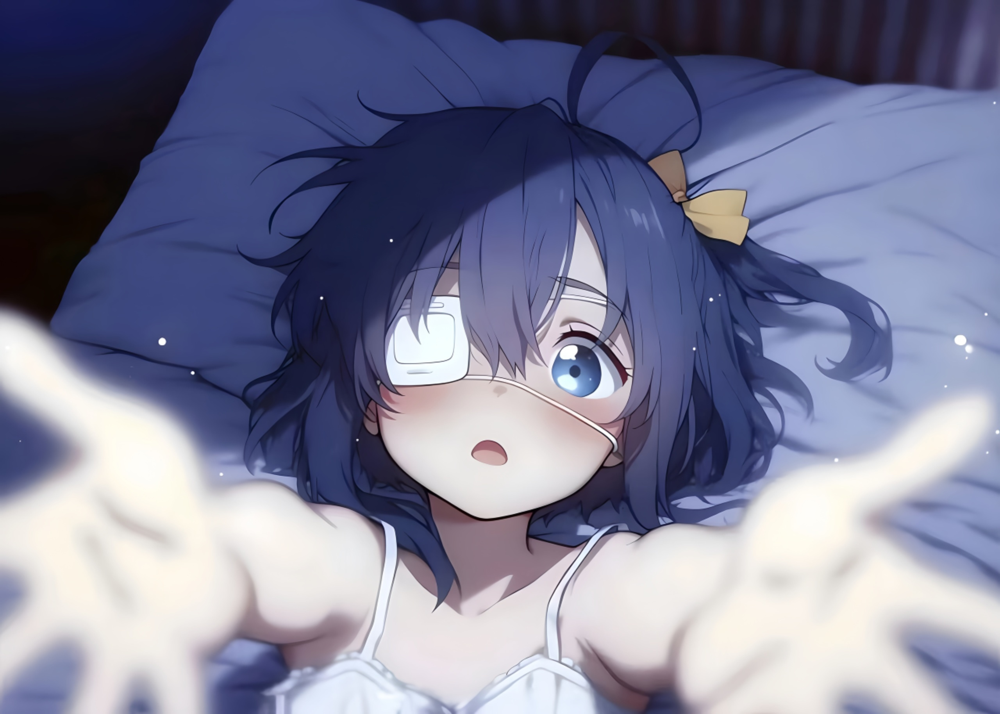

### SRSCNet

- 1x1 卷积网络，实现轻量级图像超分辨率。
- 该模型可以通过极小的参数量训练产生不错的图像增强效果。
- 相比同等非GAN训练的 SRResNet 质量相差不大且有超50倍的速度提升。

### 支持的功能
- 图片2倍超分，增强

### 效果展示

- 图像超清对比（左边是普通放大方式，右边是SRSCNet）
<table>
<tr>
<td></td>
<td></td>
</tr>
</table>

### 如何使用
- 使用预训练的模型: 
```shell
python enhance.py -i 'input.jpg' -o 'sr_image.jpg' -m 'checkpoints/checkpoint_epoch_1_batch_0.pth'
```

- 完整命令参数请使用help命令：

```shell
>> python ./enhance.py -h
usage: enhance.py [-h] [--model MODEL] [--input INPUT] [--output OUTPUT]

图像增强

options:
  -h, --help            show this help message and exit
  --model MODEL, -m MODEL
                        模型检查点路径
  --input INPUT, -i INPUT
                        输入文件路径
  --output OUTPUT, -o OUTPUT
                        输出文件路径 (默认: sr_image.jpg)
```

### 安装
1. 你需要安装python3.9 + 以及pytroch,numpy,cv2等依赖库
```
pip install torch torchvision
pip install numpy
pip install opencv-python
```

2.  获取训练好的模型，并放到工程目录下。（注意：你也可以另外放到指定目录下，但是你需要指定 --model 参数来确定加载地址）

### 如何训练

- 本工程提供了一个非GAN的训练脚本 <b>train.py</b>
```
python train.py
```

### 其他问题

1. 为什么不提使用GAN训练？
```
因为我不会设计GAN训练，暂时没时间做GAN训练。理论上GAN训练能达到更好的超分效果。 欢迎协助完善GAN训练部分
```

### 引用
- [Fully 1×1 Convolutional Network for Lightweight Image Super-Resolution](http://arxiv.org/abs/2307.16140)

